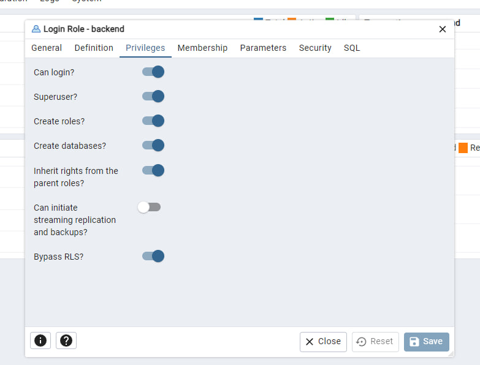
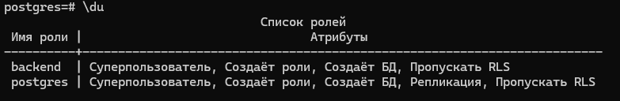
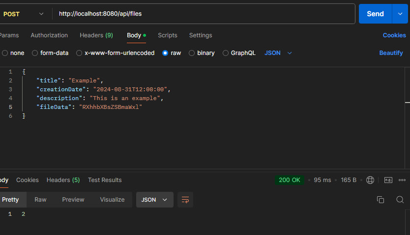
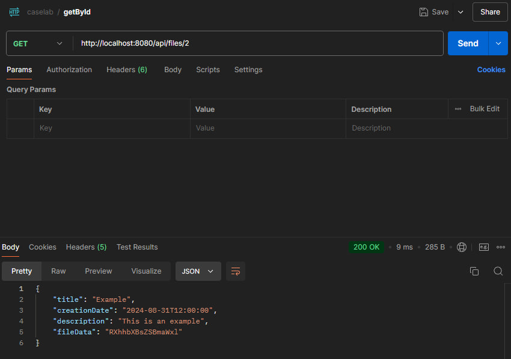
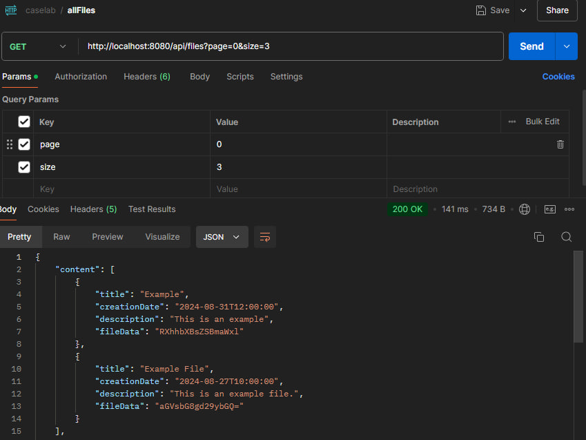

# File Management System Microservice

## Описание проекта

Этот проект представляет собой микросервис для управления файлами с помощью Spring Boot.
Сервис предоставляет REST API для загрузки файлов и хранения их в базе данных PostgreSQL, 
а также получения файлов по ID или списка всех файлов (и их атрибутов) с поддержкой пагинации 
и сортировки по времени создания.

## Структура проекта

- **FileService**: Основной сервис, отвечающий за бизнес-логику работы с файлами.
- **FileController**: REST контроллер, предоставляющий доступ к API методам.
- **DataTransferObject**: Класс, используемый для передачи данных между клиентом и сервером.
- **FileStructure**: Сущность базы данных, представляющая файл.
- **FileDBWork**: Интерфейс репозитория для работы с базой данных.

## Стек
- Spring Boot
- PostgreSQL
- JUnit

## Использованные библиотеки
### Spring Boot:
- **spring-boot-starter-web**: Для создания REST API.
- **spring-boot-starter-data-jpa**: Для работы с базой данных через JPA (Java Persistence API).
- **spring-boot-starter-test**: Для тестирования с использованием JUnit и Mockito.
### PostgreSQL:
- **postgresql**: JDBC-драйвер для взаимодействия с базой данных PostgreSQL.


## Инструкция по запуску

### Склонировать проект из GitHub
```bash
git clone https://github.com/RailSAB/caselabTest.git
```
### Настроить базу данных (psql)
```bash
CREATE DATABASE file_storage;
CREATE USER your_username WITH PASSWORD 'your_password';
GRANT ALL PRIVILEGES ON DATABASE file_storage TO your_username;
```
### Настроить Spring Boot для подключения к базе данных, с помощью application.properties
```bash
spring.datasource.url=jdbc:postgresql://localhost:5432/file_storage #который указывали в выше
spring.datasource.username=your_username #который указывали в выше
spring.datasource.password=your_password #который указывали в выше
```
### Проверьте что у вашего USER есть доступ с помощью GUI (pgAdmin, DataGrip) или командой \du в psql
В pgAdmin 4, в секции Login/Group Roles, right click по вашему юзеру и выберите Properties,
выберите все в секции Priviligies



### Запустите с помощью Maven
```bash
mvn spring-boot:run
```
Приложение будет доступно по адресу: http://localhost:8080.
Spring Boot с Hibernate автоматически создаст таблицу на основе **FileStructure**

## Примеры тестовых запросов
### Create file:
- POST 
- http://localhost:8080/api/files
- Тело запроса:
```json
{
  "title": "Example",
  "creationDate": "2024-08-31T12:00:00",
  "description": "This is an example",
  "fileData": "RXhhbXBsZSBmaWxl"
}
```
- Пример в Postman

### Get by Id
- GET
- http://localhost:8080/api/files/1
Пример в Postman

### Get all Files
- GET
- http://localhost:8080/api/files?page=0&size=3
- Пример в Postman
 
